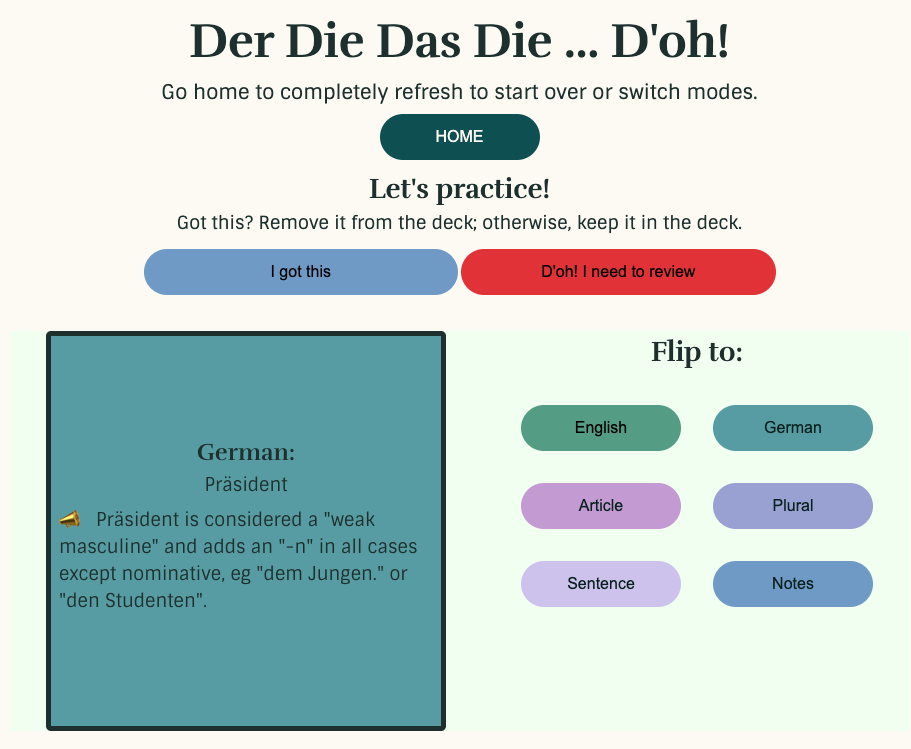

# UI for Der Die Das Die Doh

## What
A simple flashcard-style app where the user gets a stack of 5, 10, or 20 "cards" (actually cubes) to learn or study German words from a list of about 3000. Each side of the cube gives the user some info: English word, German word, German article, German word in plural form, a few sentences, and notes about the word.

User clicks a button and the cube rotates. There is no testing. Just reviewing or learning.

## Why?
 * My need for practicing German: I see many apps to practice German vocabulary with der, die, and das, but I don't see many that also add the plural. German has eight different ways of making plural and also some masculine nouns add an -en when not the nominative. 
 * My need to get into the Typescript-only mode. 

## How
 * JS and CSS: React and Typescript via Vite
 * Data: The data file is local until I know what I want and quit changing my mind as I go. The data is also for me at the moment. I will not add vocabulary I always know (man, woman, child) and stick with the ones that do my head in. Eventually an API, but until then, I'm playing with local data. I currently have a list of about 3000; however, only some are marked "completed: true", as I build the sentences and fill in the notes. I will continue to build out the word-data files even after the app is completed.

## When
 * Now: Learning, practicing, reviewing mode, logic and mostly styled
 * Next: Testing mode (user can test from the stack they're practicing OR test from a random set)
 * Next part deux: After testing is done, finish styling.
 * Later: Continuing to build out the words.

Learning Desktop:

Learning Mobile:
